# JobHub Class Diagram

Tài liệu này mô tả class diagram tổng cho project JobHub theo chuẩn UML, bao gồm:

- Các lớp domain tương ứng với bảng dữ liệu chính.
- Các lớp backend theo kiến trúc Controller → Service → Repository.
- Quan hệ giữa các entity và dependency giữa các layer.

> Lưu ý: Project hiện dùng JavaScript/Express và Supabase PostgreSQL, không có ORM entity class riêng. Vì vậy, các bảng database được biểu diễn như các UML domain class.

```mermaid
classDiagram
    direction TB

    %% =========================================================
    %% Enumerations
    %% =========================================================

    class SkillSource {
        <<enumeration>>
        MANUAL
        AI
    }

    class SalaryPeriod {
        <<enumeration>>
        HOUR
        MONTH
        YEAR
    }

    class WorkMode {
        <<enumeration>>
        ONSITE
        REMOTE
        HYBRID
    }

    class JobType {
        <<enumeration>>
        FULL_TIME
        PART_TIME
        INTERNSHIP
        CONTRACT
    }

    class ExperienceLevel {
        <<enumeration>>
        INTERN
        FRESHER
        JUNIOR
        MID
        SENIOR
        LEAD
    }

    class JobStatus {
        <<enumeration>>
        DRAFT
        OPEN
        PAUSED
        CLOSED
        EXPIRED
    }

    class ApplicationStatus {
        <<enumeration>>
        SUBMITTED
        UNDER_REVIEW
        INTERVIEW
        OFFER
        ACCEPTED
        REJECTED
        WITHDRAWN
    }

    class RecommendationStatus {
        <<enumeration>>
        NEW
        VIEWED
        DISMISSED
        APPLIED
    }

    %% =========================================================
    %% Domain Model / Database Entities
    %% =========================================================

    class JobSeeker {
        +bigint job_seeker_id
        +string full_name
        +string email
        +string password_hash
        +string phone
        +text address
        +string city
        +string headline
        +text profile_summary
        +boolean is_verified
        +boolean is_open_to_work
        +boolean is_active
        +datetime created_at
        +datetime updated_at
    }

    class Employer {
        +bigint employer_id
        +string company_name
        +string email
        +string password_hash
        +string phone
        +string website
        +text company_description
        +string city
        +string contact_name
        +string gender
        +boolean is_verified
        +boolean is_active
        +datetime created_at
        +datetime updated_at
    }

    class Admin {
        +bigint admin_id
        +string full_name
        +string email
        +string password_hash
        +datetime created_at
    }

    class Category {
        +bigint category_id
        +string name
    }

    class Skill {
        +bigint skill_id
        +string skill_name
        +datetime created_at
        +datetime updated_at
    }

    class Resume {
        +bigint resume_id
        +bigint job_seeker_id
        +string title
        +string file_name
        +string file_path
        +boolean is_primary
        +datetime upload_date
    }

    class AIAnalysis {
        +bigint analysis_id
        +bigint resume_id
        +text summary
        +json extracted_skills
        +decimal total_experience_years
        +string education_level
        +text raw_text
        +string model_version
        +datetime analyzed_at
    }

    class WorkExperience {
        +bigint experience_id
        +bigint job_seeker_id
        +string company_name
        +string position
        +date start_date
        +date end_date
        +text description
    }

    class Education {
        +bigint education_id
        +bigint job_seeker_id
        +string school_name
        +string degree
        +string major
        +smallint start_year
        +smallint end_year
    }

    class JobSeekerSkill {
        +bigint job_seeker_id
        +bigint skill_id
        +decimal experience_years
        +text skill_detail
        +SkillSource source
    }

    class Job {
        +bigint job_id
        +bigint employer_id
        +bigint category_id
        +string job_title
        +text job_description
        +decimal salary_min
        +decimal salary_max
        +string salary_currency
        +SalaryPeriod salary_period
        +boolean is_salary_negotiable
        +string location
        +string city
        +string country
        +WorkMode work_mode
        +JobType job_type
        +ExperienceLevel experience_level
        +int positions_available
        +date application_deadline
        +JobStatus status
        +boolean is_approved
        +datetime created_at
        +datetime updated_at
    }

    class JobSkill {
        +bigint job_id
        +bigint skill_id
        +boolean is_required
        +decimal min_experience_years
        +smallint weight
    }

    class Application {
        +bigint application_id
        +bigint job_seeker_id
        +bigint job_id
        +bigint resume_id
        +text cover_letter
        +ApplicationStatus status
        +datetime application_date
        +datetime updated_at
    }

    class JobRecommendation {
        +bigint recommendation_id
        +bigint job_seeker_id
        +bigint job_id
        +bigint resume_id
        +decimal match_score
        +text recommendation_reason
        +RecommendationStatus status
        +datetime generated_at
    }

    class SavedJob {
        +bigint job_seeker_id
        +bigint job_id
        +datetime saved_at
    }

    class Notification {
        +bigint notification_id
        +bigint job_seeker_id
        +bigint employer_id
        +string type
        +string title
        +text message
        +boolean is_read
        +datetime created_at
    }

    class AIMatchingLog {
        +bigint log_id
        +bigint job_seeker_id
        +text prompt_text
        +text response_text
        +string model_name
        +int total_jobs_sent
        +int processing_time_ms
        +string task
        +int tokens_in
        +int tokens_out
        +boolean success
        +text error
        +datetime created_at
    }

    %% =========================================================
    %% Backend Controllers
    %% =========================================================

    class AuthController {
        <<controller>>
        +register(req, res)
        +login(req, res)
        +me(req, res)
    }

    class JobController {
        <<controller>>
        +getJobs(req, res)
        +getJobById(req, res)
        +createJob(req, res)
        +updateJob(req, res)
        +deleteJob(req, res)
    }

    class EmployerController {
        <<controller>>
        +register(req, res)
        +getProfile(req, res)
        +updateProfile(req, res)
        +getMyJobs(req, res)
    }

    class ResumeController {
        <<controller>>
        +uploadResume(req, res)
        +getMyResume(req, res)
        +getResumeById(req, res)
        +deleteResume(req, res)
    }

    class ApplicationController {
        <<controller>>
        +applyJob(req, res)
        +getMyApplications(req, res)
        +getApplicationById(req, res)
        +updateStatus(req, res)
    }

    class RecommendationController {
        <<controller>>
        +getRecommendations(req, res)
        +getRecommendationInsights(req, res)
    }

    %% =========================================================
    %% Backend Services
    %% =========================================================

    class AuthService {
        <<service>>
        +register(payload)
        +login(payload)
    }

    class JobService {
        <<service>>
        +searchJobs(filters)
        +getJobById(jobId)
        +createJob(employerId, payload)
        +updateJob(employerId, jobId, payload)
        +deleteJob(employerId, jobId)
    }

    class EmployerService {
        <<service>>
        +register(payload)
        +getProfile(employerId)
        +updateProfile(employerId, payload)
        +getMyJobs(employerId, query)
    }

    class JobSeekerService {
        <<service>>
        +getProfile(userId)
        +updateProfile(userId, payload)
        +setPreferences(userId, preferences)
        +getSavedJobs(userId)
    }

    class ResumeService {
        <<service>>
        +uploadResume(userId, file)
        +getResume(userId, resumeId)
        +updateResume(userId, resumeId, payload)
        +deleteResume(userId, resumeId)
    }

    class ApplicationService {
        <<service>>
        +applyJob(userId, payload)
        +getMyApplications(userId, query)
        +getApplicationById(userId, applicationId)
    }

    class RecommendationService {
        <<service>>
        +getRecommendations(userId, context)
        +getRecommendationInsights(userId, jobId)
    }

    %% =========================================================
    %% Backend Repositories
    %% =========================================================

    class AuthRepository {
        <<repository>>
        +createJobSeeker(payload)
        +createEmployer(payload)
        +findByEmail(email)
    }

    class JobRepository {
        <<repository>>
        +searchJobs(filters)
        +findJobById(id)
        +createJob(payload)
        +updateJob(id, payload)
        +deleteJob(id)
    }

    class EmployerRepository {
        <<repository>>
        +createEmployer(payload)
        +findEmployerById(id)
        +updateEmployer(id, payload)
        +findJobsByEmployer(id, query)
    }

    class JobSeekerRepository {
        <<repository>>
        +getProfile(userId)
        +upsertProfile(userId, payload)
        +getSavedJobs(userId)
    }

    class ResumeRepository {
        <<repository>>
        +saveResume(payload)
        +findResumeById(id)
        +findResumesByUser(userId)
        +updateResume(id, payload)
        +deleteResume(id)
    }

    class ApplicationRepository {
        <<repository>>
        +createApplication(payload)
        +findApplicationById(id)
        +findApplicationsByCandidate(userId, query)
        +updateApplicationStatus(id, status)
    }

    class RecommendationRepository {
        <<repository>>
        +getCandidateProfile(userId)
        +filterCandidateJobs(userId, filters)
        +saveRecommendation(payload)
    }

    %% =========================================================
    %% Infrastructure / External Services
    %% =========================================================

    class SupabaseClient {
        <<database client>>
        +from(table)
        +select(columns)
        +insert(payload)
        +update(payload)
        +delete()
    }

    class DeepSeekClient {
        <<external AI client>>
        +callAI(prompt)
    }

    class PromptBuilder {
        <<utility>>
        +buildPrompt(context)
    }

    %% =========================================================
    %% Domain Relationships
    %% =========================================================

    JobSeeker "1" *-- "0..*" Resume : owns
    Resume "1" *-- "0..*" AIAnalysis : analyzed by

    JobSeeker "1" *-- "0..*" WorkExperience : has
    JobSeeker "1" *-- "0..*" Education : has

    JobSeeker "1" -- "0..*" JobSeekerSkill : has
    Skill "1" -- "0..*" JobSeekerSkill : referenced by
    JobSeekerSkill --> SkillSource : uses

    Employer "1" *-- "0..*" Job : posts
    Category "0..1" -- "0..*" Job : categorizes

    Job "1" -- "0..*" JobSkill : requires
    Skill "1" -- "0..*" JobSkill : referenced by

    Job --> SalaryPeriod : uses
    Job --> WorkMode : uses
    Job --> JobType : uses
    Job --> ExperienceLevel : uses
    Job --> JobStatus : uses

    JobSeeker "1" -- "0..*" Application : submits
    Job "1" -- "0..*" Application : receives
    Resume "0..1" -- "0..*" Application : attached to
    Application --> ApplicationStatus : uses

    JobSeeker "1" -- "0..*" JobRecommendation : receives
    Job "1" -- "0..*" JobRecommendation : recommended as
    Resume "0..1" -- "0..*" JobRecommendation : based on
    JobRecommendation --> RecommendationStatus : uses

    JobSeeker "1" -- "0..*" SavedJob : saves
    Job "1" -- "0..*" SavedJob : saved in

    JobSeeker "0..1" -- "0..*" Notification : receives
    Employer "0..1" -- "0..*" Notification : receives

    JobSeeker "0..1" -- "0..*" AIMatchingLog : creates

    %% =========================================================
    %% Layer Dependencies
    %% =========================================================

    AuthController ..> AuthService : uses
    JobController ..> JobService : uses
    EmployerController ..> EmployerService : uses
    ResumeController ..> ResumeService : uses
    ApplicationController ..> ApplicationService : uses
    RecommendationController ..> RecommendationService : uses

    AuthService ..> AuthRepository : uses
    AuthService ..> JobSeeker : creates
    AuthService ..> Employer : creates

    JobService ..> JobRepository : uses
    JobService ..> Job : manages

    EmployerService ..> EmployerRepository : uses
    EmployerService ..> Employer : manages
    EmployerService ..> Job : reads

    JobSeekerService ..> JobSeekerRepository : uses
    JobSeekerService ..> JobSeeker : manages
    JobSeekerService ..> SavedJob : reads

    ResumeService ..> ResumeRepository : uses
    ResumeService ..> Resume : manages
    ResumeService ..> AIAnalysis : creates

    ApplicationService ..> ApplicationRepository : uses
    ApplicationService ..> Application : manages

    RecommendationService ..> RecommendationRepository : uses
    RecommendationService ..> JobRecommendation : manages
    RecommendationService ..> DeepSeekClient : calls
    RecommendationService ..> PromptBuilder : builds prompt

    AuthRepository ..> SupabaseClient : queries
    JobRepository ..> SupabaseClient : queries
    EmployerRepository ..> SupabaseClient : queries
    JobSeekerRepository ..> SupabaseClient : queries
    ResumeRepository ..> SupabaseClient : queries
    ApplicationRepository ..> SupabaseClient : queries
    RecommendationRepository ..> SupabaseClient : queries
```

## UML Notes

- `+` biểu thị public attribute hoặc public operation.
- `*--` biểu thị composition/ownership theo vòng đời dữ liệu, ví dụ `JobSeeker` sở hữu `Resume`.
- `--` biểu thị association giữa các class/domain entity.
- `..>` biểu thị dependency, thường dùng cho quan hệ gọi giữa controller, service, repository và infrastructure.
- Multiplicity:
  - `1`: đúng một đối tượng.
  - `0..1`: có thể không có hoặc có một.
  - `0..*`: không có hoặc có nhiều.

## Source References

Diagram này được tổng hợp từ:

- `docs/08_DATABASE.md`
- `docs/02_ARCHITECTURE.md`
- `backend/src/controllers`
- `backend/src/services`
- `backend/src/repositories`
